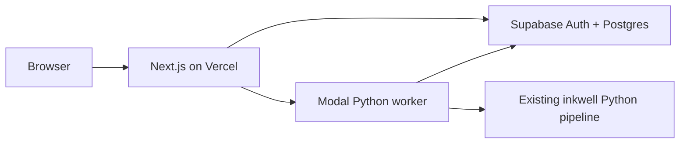
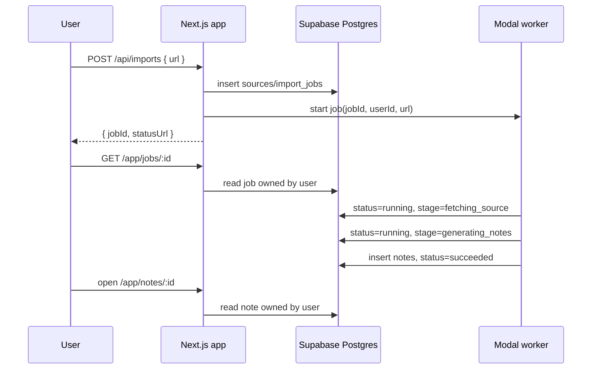

# feat: Inkwell Web app on Vercel, Supabase, and Modal

## Overview

Build the first real web version of Inkwell: a private, account-based app where users can paste a media or feed URL, run the existing Inkwell Python pipeline, and save generated markdown notes into a searchable library.

This replaces the reverted demo/FastAPI direction. The product is not a public try-it page, a GCP deployment exercise, or a rewrite of the pipeline in TypeScript.

## Product Contract

### Core Promise

Inkwell turns media and feed URLs into saved, readable notes that live in a user's private web library.

### MVP User Flows

1. User signs up or signs in.
2. User lands in `/app` with a clear empty state when no notes exist.
3. User opens `/app/new`, pastes a supported URL, and starts an import.
4. The app creates a durable `import_jobs` row tied to that user.
5. The app dispatches the job to a Python worker.
6. User watches `/app/jobs/:id` show calm, human-readable processing stages.
7. On success, the worker writes a saved note and the user reads it at `/app/notes/:id`.
8. User can return to `/app/library` later and search/filter saved notes.
9. Failed jobs show a friendly retry path and keep server-side error detail for debugging.

### Out Of Scope For MVP

- Public sharing.
- Billing.
- Browser extension.
- Team/workspace permissions.
- Scheduled recurring ingestion.
- Rewriting the pipeline in TypeScript.
- Cloud Run, Cloud Tasks, Firestore, Artifact Registry, or Secret Manager.
- Cloudflare Workers as the primary backend.
- Student-facing or social features.

## Stack Decision

- **Web app:** Next.js App Router in `apps/web`, deployed on Vercel from the same GitHub repository using Vercel's root-directory setting.
- **Auth and data:** Supabase Auth plus Supabase Postgres.
- **Worker:** Modal-hosted Python function/service wrapping the existing `src/inkwell` pipeline.
- **Storage:** Postgres first. Add Supabase Storage, Vercel Blob, or R2 only if note payloads/artifacts exceed practical row sizes.

## Repository Ergonomics

Keep the stable Python package where it is:

```text
inkwell-cli/
  src/inkwell/              # existing Python package and CLI
  tests/                    # existing Python tests
  apps/web/                 # Next.js app, Vercel root directory
  workers/inkwell/          # Modal worker adapter around existing pipeline
  supabase/migrations/      # Postgres schema, indexes, RLS
  docs/plans/               # implementation plans
```

Do not move `src/inkwell` into `packages/` during the MVP. That refactor can happen later if the monorepo grows, but doing it now would create packaging churn before the web product has shipped a first vertical slice.

Root-level JS workspace files are acceptable when needed:

- `package.json` for repo-level web scripts.
- `pnpm-workspace.yaml` for `apps/*`.
- `pnpm-lock.yaml` for deterministic web installs.

Python tooling remains `uv`.

## Architecture



### Request And Job Flow



## Database Model

### `profiles`

- `id uuid primary key references auth.users(id)`
- `email text not null`
- `display_name text`
- `created_at timestamptz not null default now()`

### `sources`

- `id uuid primary key default gen_random_uuid()`
- `user_id uuid not null references auth.users(id)`
- `url text not null`
- `normalized_url text not null`
- `source_type text`
- `title text`
- `created_at timestamptz not null default now()`

### `import_jobs`

- `id uuid primary key default gen_random_uuid()`
- `user_id uuid not null references auth.users(id)`
- `source_id uuid not null references sources(id)`
- `status text not null check in queued/running/succeeded/failed/cancelled`
- `stage text`
- `worker_run_id text`
- `error_code text`
- `error_message text`
- `created_at timestamptz not null default now()`
- `started_at timestamptz`
- `finished_at timestamptz`

### `notes`

- `id uuid primary key default gen_random_uuid()`
- `user_id uuid not null references auth.users(id)`
- `source_id uuid not null references sources(id)`
- `import_job_id uuid not null references import_jobs(id)`
- `title text not null`
- `body_markdown text not null`
- `summary text`
- `metadata jsonb not null default '{}'::jsonb`
- `created_at timestamptz not null default now()`
- `updated_at timestamptz not null default now()`

### RLS Policy Shape

All user-facing tables enable RLS. Authenticated users can select/insert/update/delete only rows where `user_id = auth.uid()`. Server-side worker operations use the Supabase service role key and must never expose it to the browser.

## API Contract

### `POST /api/imports`

Creates a durable import job for the signed-in user and dispatches it to the worker.

Input:

```json
{ "url": "https://..." }
```

Output:

```json
{ "jobId": "...", "statusUrl": "/app/jobs/..." }
```

### `GET /api/jobs/:id`

Returns job status for the signed-in user.

Output:

```json
{
  "status": "queued",
  "stage": "queued",
  "noteId": null,
  "error": null
}
```

### `GET /api/notes/:id`

Returns a saved note for the signed-in user. UI pages may also read directly from Supabase in Server Components when RLS and session handling are in place.

## Worker Contract

The first worker interface is intentionally narrow:

```json
{
  "jobId": "uuid",
  "userId": "uuid",
  "url": "https://..."
}
```

The worker must:

1. Mark the job `running`.
2. Move through known stages:
   - `queued`
   - `fetching_source`
   - `extracting_transcript`
   - `generating_notes`
   - `saving_result`
   - `done`
3. Run the existing Python pipeline.
4. Write a `notes` row with readable markdown.
5. Mark the job `succeeded`.
6. On failure, mark the job `failed` with friendly `error_code` and non-sensitive `error_message`.

The worker must not require a browser session token. It uses service credentials scoped to the server/worker environment.

## Implementation Units

### Unit 1: Planning And Repo Boundary

Files:

- `docs/plans/2026-05-08-001-inkwell-web-app-plan.md`
- `docs/building-in-public/adr/037-web-app-stack-and-repo-boundary.md`
- `docs/building-in-public/devlog/2026-05-08-inkwell-web-app.md`

Acceptance:

- Plan captures the product scope, stack, repo layout, data model, worker contract, and implementation slices.
- ADR explicitly rejects the reverted demo path.

### Unit 2: Web Workspace Scaffold

Files:

- `package.json`
- `pnpm-workspace.yaml`
- `apps/web/package.json`
- `apps/web/src/app/**`
- `apps/web/src/components/**`
- `apps/web/src/lib/**`

Acceptance:

- `pnpm --dir apps/web build` succeeds.
- App Router routes exist for `/login`, `/app`, `/app/new`, `/app/jobs/[id]`, `/app/notes/[id]`, `/app/library`, and `/app/settings`.
- Private routes share an app shell with simple `New`, `Library`, and `Settings` navigation.
- Empty states and error states are visible without real data.

### Unit 3: Supabase Schema And Client Layer

Files:

- `supabase/migrations/202605080001_inkwell_web_core.sql`
- `apps/web/src/lib/supabase/server.ts`
- `apps/web/src/lib/supabase/browser.ts`
- `apps/web/src/lib/database.types.ts`
- `apps/web/src/proxy.ts`

Acceptance:

- Migration creates tables, indexes, updated-at trigger, and RLS policies.
- Server client is initialized lazily and safely for Next.js build.
- Next.js Proxy refreshes Supabase auth and redirects unauthenticated users away from `/app`.

### Unit 4: Durable Import API

Files:

- `apps/web/src/app/api/imports/route.ts`
- `apps/web/src/app/api/jobs/[id]/route.ts`
- `apps/web/src/lib/imports.ts`
- `apps/web/src/lib/worker-dispatch.ts`

Acceptance:

- `POST /api/imports` validates URL input, creates source/job records, and returns `jobId`.
- When worker dispatch is disabled/missing env, the job remains queued and the response is still durable for local development.
- `GET /api/jobs/:id` only returns jobs owned by the signed-in user.

### Unit 5: Modal Worker Skeleton

Files:

- `workers/inkwell/modal_app.py`
- `workers/inkwell/worker.py`
- `workers/inkwell/README.md`
- `pyproject.toml`

Acceptance:

- Worker image installs `ffmpeg` and the current package.
- Worker exposes a single authenticated job start endpoint.
- Worker spawns the long-running pipeline function and returns a Modal `workerRunId`.
- Worker can update job status and write notes through Supabase service credentials.
- Secrets are documented but not committed.

### Unit 6: Pipeline Adapter

Files:

- `workers/inkwell/worker.py`

Acceptance:

- Existing pipeline can be invoked by URL with a temporary output directory.
- Generated markdown files are collected into one readable `body_markdown`.
- Metadata is normalized for the `notes.metadata` JSON column.
- Worker marks jobs failed with a non-sensitive error if pipeline execution raises.

### Unit 7: UI Vertical Slice

Files:

- `apps/web/src/app/(app)/new/**`
- `apps/web/src/app/(app)/jobs/[id]/**`
- `apps/web/src/app/(app)/notes/[id]/**`
- `apps/web/src/app/(app)/library/**`

Acceptance:

- User can create a job from the UI.
- Job page refreshes status while queued/running.
- Succeeded job links to note page.
- Library lists and filters recent notes and failed/retryable jobs.
- Note page renders markdown cleanly and supports copying markdown.

### Unit 8: Deployment And Smoke

Files:

- `apps/web/vercel.json` if needed.
- `apps/web/.env.example`
- `workers/inkwell/README.md`
- GitHub/Vercel project settings documentation.

Acceptance:

- Vercel project points to `apps/web`.
- Supabase env vars are configured in Vercel.
- Modal app is deployed with worker secrets.
- Smoke test proves signup, import creation, job status, and private note access.

## Risks And Mitigations

- **Long-running jobs in request handlers:** Vercel never runs the pipeline directly. It creates durable jobs and dispatches Modal.
- **RLS mistakes:** Start with strict owner policies and test cross-user access.
- **Pipeline output assumptions:** Add a Python adapter that reads actual generated files rather than assuming one fixed file.
- **Worker idempotency:** Worker should tolerate duplicate dispatch for the same `jobId`; if already running/succeeded, it should not create duplicate notes.
- **Frontend drift into marketing page:** First screen after auth is the usable library/new-import workflow, not a landing page.
- **Package churn:** Do not move the Python package during MVP.

## Verification Plan

- Python: `uv run ruff check .`, `uv run pytest`.
- Web: `pnpm --dir apps/web lint`, `pnpm --dir apps/web build`.
- Database: apply migration locally or in Supabase preview project; verify RLS with two users.
- Worker: `modal serve workers/inkwell/modal_app.py` for local smoke; `modal deploy` for production.
- Browser: verify `/login`, `/app`, `/app/new`, `/app/jobs/:id`, `/app/notes/:id`, and `/app/library` in desktop and mobile viewports.

## Sources

- Paperclip spec snapshot: `/Users/chekos/Documents/Codex/2026-05-08/i-have-a-paperclip-company-running/inkwell-web-app-spec.md`
- Vercel monorepos: https://vercel.com/docs/monorepos
- Modal scaling: https://modal.com/docs/guide/scale
- Modal web endpoints: https://modal.com/docs/guide/webhooks
- Supabase SSR: https://github.com/supabase/ssr
- Supabase RLS: https://supabase.com/docs/learn/auth-deep-dive/auth-row-level-security
