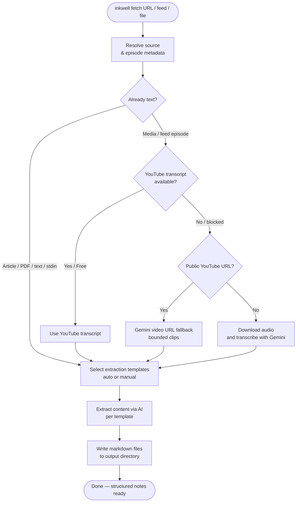

# Processing Episodes

Fetch and process podcast episodes with Inkwell.

---

## Basic Usage

### Process from URL

Process any YouTube video or podcast episode directly:

```bash
inkwell fetch https://youtube.com/watch?v=xyz
```

### Process from Local Files or Stdin

Local audio/video routes through transcription. Local text/markdown, local text PDFs, web articles, and stdin are treated as source text for the extraction templates.

```bash
# Local audio/video
inkwell fetch ~/Downloads/interview.mp3

# Local text or markdown
inkwell fetch ./notes.md

# Local text PDF
inkwell fetch ./paper.pdf

# Web article
inkwell fetch https://example.com/article

# Pasted/stdin text
pbpaste | inkwell fetch -
```

See [Supported Inputs](../reference/supported-inputs.md) for the full input matrix and planned future formats.

### Process from Feed

If you've added a feed, process by feed name:

```bash
# Latest episode
inkwell fetch my-podcast --latest

# Latest 5 episodes
inkwell fetch my-podcast --count 5
```

---

## The Processing Pipeline

When you run `inkwell fetch`, here's what happens:



**Example output:**

```
Inkwell Extraction Pipeline

Step 1/4: Transcribing episode...
✓ Transcribed (youtube)
  Duration: 3600.0s
  Words: ~9500

Step 2/4: Selecting templates...
✓ Selected 3 templates:
  • summary (priority: 0)
  • quotes (priority: 5)
  • key-concepts (priority: 10)

Step 3/4: Extracting content...
  Estimated cost: $0.0090
✓ Extracted 3 templates
  • 0 from cache (saved $0.0000)
  • Total cost: $0.0090

Step 4/4: Writing markdown files...
✓ Wrote 3 files
  Directory: ./output/episode-2025-11-07-title/

✓ Complete!
```

---

## Command Options

| Option | Short | Description | Default |
|--------|-------|-------------|---------|
| `--output-dir` | `-o` | Output directory | `~/inkwell-notes` |
| `--count` | | Latest N episodes from a saved feed | |
| `--templates` | `-t` | Comma-separated template list | Auto-select |
| `--category` | `-c` | Episode category | Auto-detect |
| `--provider` | `-p` | LLM provider (claude, gemini) | Smart selection |
| `--skip-cache` | | Skip extraction cache | `false` |
| `--force-extraction` | | Run LLM extraction even when short-content bypass would apply | `false` |
| `--dry-run` | | Cost estimate only | `false` |
| `--extract` | | Emit transcript/source text only and skip note generation | `false` |
| `--overwrite` | | Overwrite existing directory | `false` |
| `--interview` | | Enable interview mode | `false` |

---

## Output Structure

Each episode creates a self-contained directory:

```
~/inkwell-notes/
└── podcast-2025-01-15-episode-title/
    ├── .metadata.yaml       # Episode metadata
    ├── summary.md           # Episode summary
    ├── quotes.md            # Notable quotes
    ├── key-concepts.md      # Key concepts
    └── tools-mentioned.md   # Tools and products
```

**Directory naming pattern:**

```
{podcast-name}-{YYYY-MM-DD}-{episode-title}/
```

### Metadata File

`.metadata.yaml` contains:

```yaml
podcast_name: Deep Questions
episode_title: Episode 42 - On Focus
episode_url: https://youtube.com/watch?v=xyz
transcription_source: youtube
templates_applied:
  - summary
  - quotes
  - key-concepts
total_cost_usd: 0.009
timestamp: 2025-11-07T10:30:00
```

### Markdown Files

Each template generates a markdown file with YAML frontmatter:

```markdown
---
template: summary
podcast: Deep Questions
episode: Episode 42 - On Focus
date: 2025-11-07
source: https://youtube.com/watch?v=xyz
---

# Summary

Episode overview and key takeaways...
```

---

## Example Workflows

### Quick Extract with Defaults

```bash
inkwell fetch https://youtube.com/watch?v=abc123
```

Uses auto-detected category, auto-selected templates, and smart provider selection.

### Custom Output Location

```bash
inkwell fetch URL --output ~/Documents/podcast-notes
```

### Specific Templates

```bash
inkwell fetch URL --templates summary,quotes,tools-mentioned
```

### Cost Check First

```bash
# Check cost without processing
inkwell fetch URL --dry-run

# If acceptable, process
inkwell fetch URL
```

### Transcript Only

```bash
# Print transcript text to stdout; progress goes to stderr
inkwell fetch URL --extract

# Write transcript-only files without creating episode note directories
inkwell fetch my-podcast --latest --extract --output-dir ~/transcripts --plain
```

Use this when you want the clean media transcript or source text first and want to decide later whether to run Inkwell's structured note templates or reflection flow.

Web articles and text PDFs use local extraction. Hosted article fallbacks, slide decks, and OCR/image PDFs are not part of this path yet.

For script-friendly `--json` and `--plain` output, see [Machine-Readable Output](../reference/machine-readable-output.md).

### Re-extract with Different Templates

```bash
# Initial extraction
inkwell fetch URL --templates summary,quotes

# Add more templates later
inkwell fetch URL --templates summary,quotes,key-concepts --overwrite
```

---

## Transcription

### YouTube Transcripts (Free)

Inkwell first checks for existing YouTube transcripts. These are:

- **Free** - No API cost
- **Fast** - Already available
- **Accurate** - Human-corrected for popular videos
- **Flexible** - Inkwell can use available non-English captions when English captions are missing

### Gemini Fallback

If no YouTube transcript exists or YouTube blocks the worker, Inkwell uses Google's Gemini:

- Public YouTube URLs: process bounded video clips directly from the URL
- Other sources: download audio and transcribe using Gemini Flash
- Cost: URL input is currently a Gemini preview feature; downloaded audio is billed by Gemini usage

---

## Caching

Inkwell caches both transcripts and extractions:

- **Transcripts** - Cached indefinitely
- **Extractions** - Cached for 30 days

**Cache behavior:**

- Re-running the same extraction costs $0 (cache hit)
- Template version changes invalidate cache
- Use `--skip-cache` to force fresh extraction

---

## Error Handling

### Network Errors

```
✗ Failed to transcribe episode
  Reason: Network connection timeout

Suggestion: Check internet connection and retry
```

### Invalid URL

```
✗ Invalid episode URL
  URL: not-a-valid-url

Suggestion: Provide a valid YouTube or podcast URL
```

### Directory Exists

```
✗ Episode directory already exists
  Directory: ./output/podcast-2025-11-07-title/

Suggestion: Use --overwrite to replace, or delete manually
```

---

## Next Steps

- [Content Extraction](extraction.md) - Templates and providers
- [Interview Mode](interview.md) - Capture personal insights
- [Obsidian Integration](obsidian.md) - Use with Obsidian
